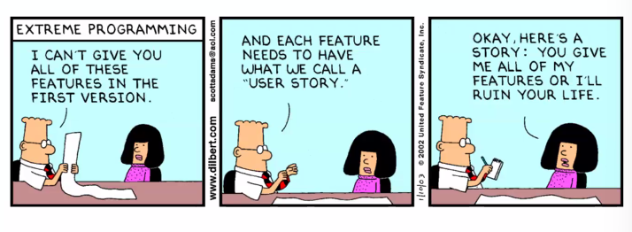
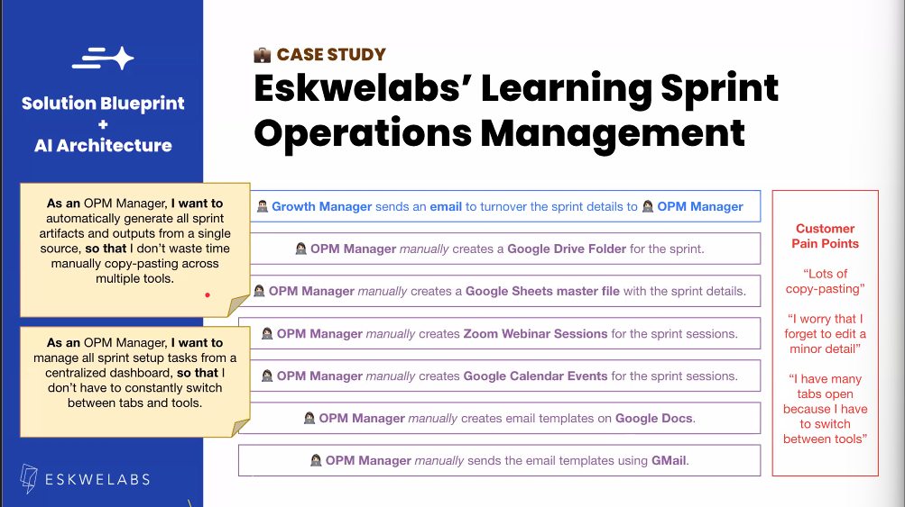
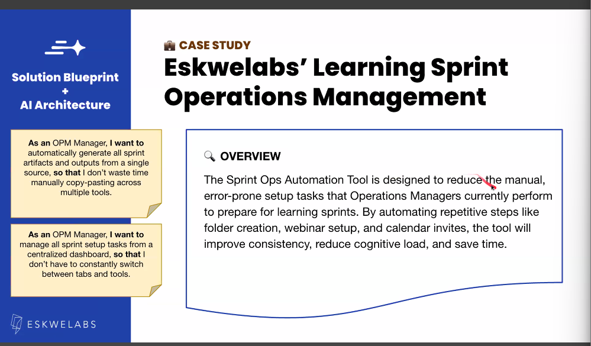
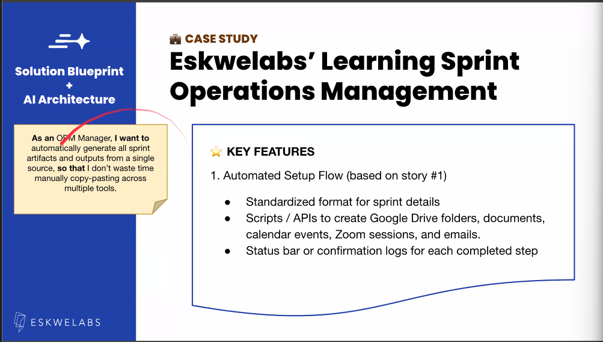
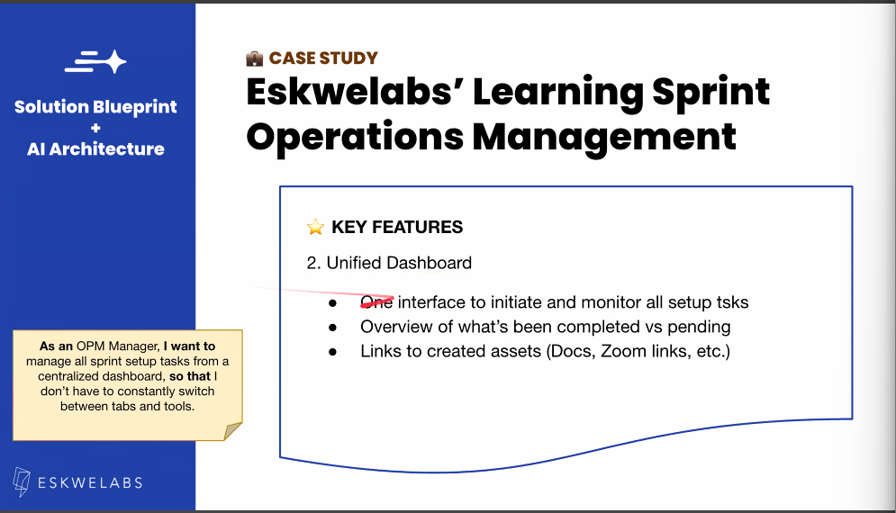
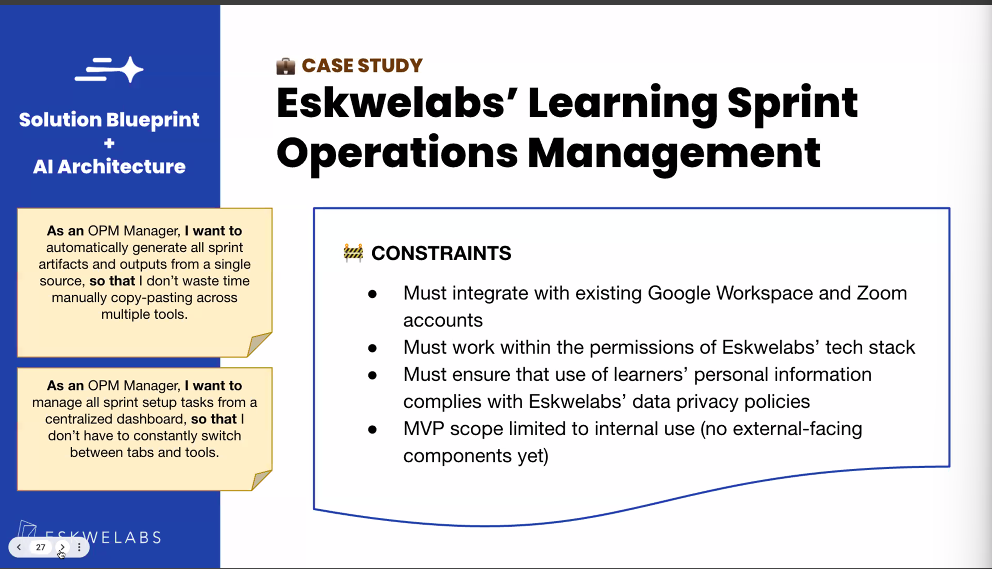
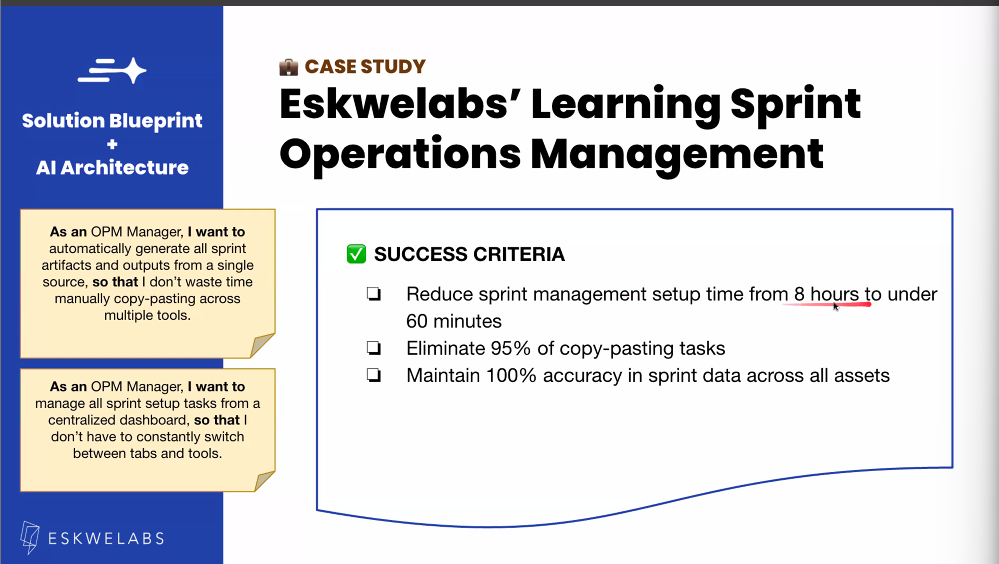
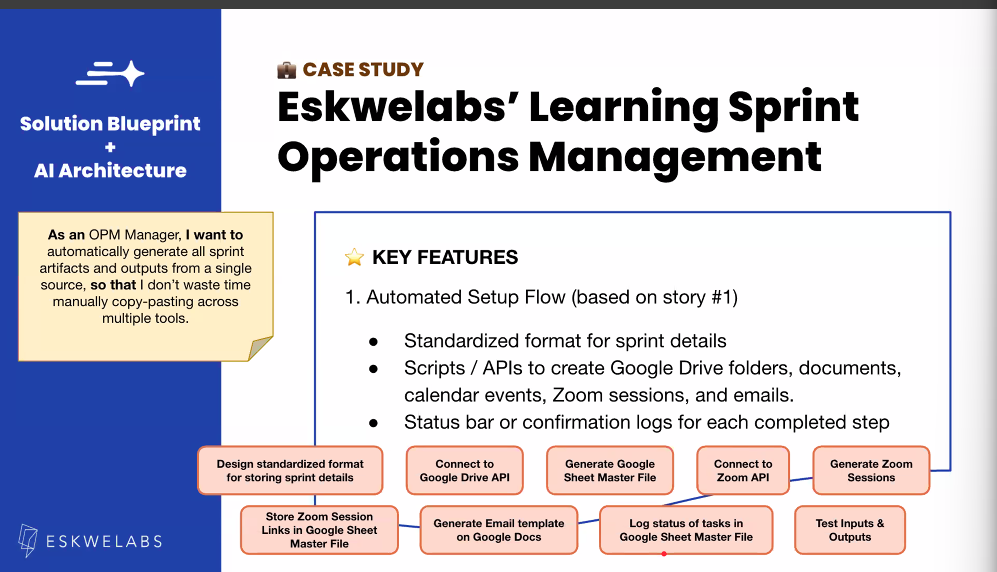

# Solution Blueprint & AI Architecture

## Resources

- [Prompt Library](https://docs.google.com/document/d/1hZCYK48y5-n2fuJRonC01PVLS4GUrm3zGIbpnh87vOo/edit?tab=t.0#heading=h.6ltpme3myqxt)

## Solution Architecture

### What is Solution Architecture?

Solution architecture is a structured approach that defines how your solution will work. It serves as:

- A **map** of the key components, systems, and processes that interact to solve the user's problem
- **Not just a wiring diagram** for engineers, but a comprehensive map of how your solution creates value for users, step by step
- A **user-centered design** where your solution architecture should follow the user's journey, not the other way around

### Key Principles for Solution Architecture

Before sketching your architecture, understand these fundamental questions:

- **Who is your user?**
- **What are they trying to do?**
- **Where are their pain points?**

### Process: Map the Journey, Surface the System

**Goal:** Identify key user moments and extract what the system must do to support them.

## User Stories & Product Requirements Document (PRD)

### User Stories



**Definition:** A short, simple statement that describes a feature or function from the user's perspective.

**Template:**
```
"As a [user role],
I want to [do something]
so that [goal]."
```

#### How to Write Effective User Stories

- **Start with real user insights** - Base your stories on actual user research and feedback
- **Be specific but not prescriptive** - Define what needs to be done, not exactly how
- **Describe what, not how** - Focus on the outcome, not the implementation
- **Focus on value and motivation** - Always include the "why" behind the request

**Example Pain Points and User Stories:**


### Product Requirements Document (PRD)

**Definition:** A PRD is a blueprint that turns your user stories into a clear, buildable product plan.

It defines **what** you're building, **why** it matters, and **how** it works.

#### Components of a PRD

**1. Overview**


**2. Key Features**



**3. Constraints**


**4. Success Criteria**


### Sprint Backlog

**Definition:** A focused, prioritized list of tasks your team commits to completing within a short, defined period (usually 1-2 weeks).

#### What Goes Into a Sprint Backlog?

- **Features broken into small, buildable tasks** - Manageable chunks that can be completed within the sprint
- **Technical or design subtasks** - Supporting work needed to deliver features
- **Clear sprint goal** - What will be demo-ready at the end of this sprint?

**Example Sprint Backlog:**


#### Implementation Tools

- **Create a Kanban board** to visualize and track progress
- **Use the Prompt Library** to create product artifacts (user stories, PRDs, backlog tasks)

## Prototyping

### What is a Prototype?

A **simplified version** of your solution that allows you to test and demonstrate your core ideas before building the full product.

### Why Prototype?

Prototyping offers several key benefits:

- **Test assumptions quickly** - Validate your ideas with minimal investment
- **Get feedback early** - Identify issues and improvements before full development
- **Align your team** - Ensure everyone understands what the solution should feel like
- **Reduce risk** - Minimize the chance of building the wrong thing

### Types of Prototypes

A prototype might take various forms depending on your needs:

- **Clickable UI mockup** - Interactive wireframes or designs
- **AI-generated feature script** - Automated functionality demonstrations
- **Simulated workflow or chatbot** - Process flows and conversation designs
- **Interaction diagrams** - Visual representations of system logic and user flows